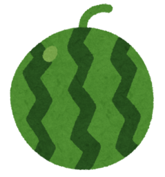
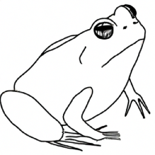
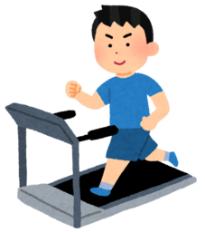
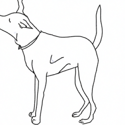
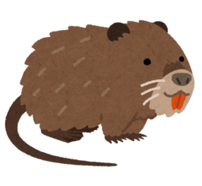
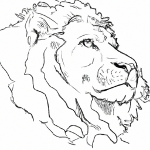
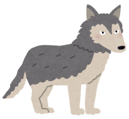
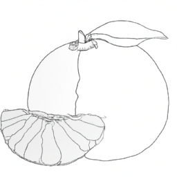
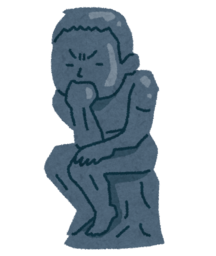
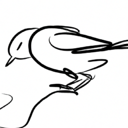

# お絵描きしりとりの実行例。

`send_*.png` はいずれも、 [いらすとや](https://www.irasutoya.com)より引用。 (Copyright: みふねたかし)
markdownで見やすいようサイズを256x256以下にリサイズ。
実行時は [いらすとや](https://www.irasutoya.com)の画像リンクを直接利用したため、リポジトリ上の画像とは異なるものを利用しています。

引用元URL
- https://www.irasutoya.com/2020/09/blog-post_808.html (丸いスイカのイラスト)
- https://www.irasutoya.com/2018/06/blog-post_917.html (ランニングマシンで走る人のイラスト（男性）)
- https://www.irasutoya.com/2017/03/blog-post_718.html (ヌートリアのイラスト)
- https://www.irasutoya.com/2014/02/blog-post_7287.html (オオカミのイラスト)
- https://www.irasutoya.com/2014/02/blog-post_28.html (考える人のイラスト)



ユーザの想定「すいか」 GPTの解釈「すいか」


GPTの生成「かえる(かえる / frog)」 ユーザの解釈「かえる」


ユーザの想定「るーむらんなー」 GPTの解釈「るんにんぐますしん」 <-？？？？


GPTの生成「いぬ(犬 / Dog)」 ユーザの解釈「いぬ」 <- 「単語」と「読み(ルビ)」が入れ替わってしまっている


ユーザの想定「ぬーとりあ」 GPTの解釈「ビーバー」


GPTの生成「ライオン(らいおん / Lion)」 ユーザの解釈「ライオン」  <- なぜ「ビーバー」に対して「ライオン」なのか？


ユーザの想定「おおかみ」 GPTの解釈「おおかみ」


GPTの生成「みかん(みかん / Mandarin orange)」 ユーザの解釈「みかん」


ユーザの想定「考える人」 GPTの解釈「かんがえごと」


GPTの生成「とり(とり / bird)」 ユーザの解釈「とり」

結論: じゃっかんポンコツ。

以下、実際のコンソール上のやりとり(一部)
```
「ん」で終わる場合、一文字手前の文字を使います
しりとりの最初の文字は「す」です
ラウンド1/5: 単語を表す画像のURLを入力してください
https://1.bp.blogspot.com/-4twz96rvKOQ/X2VqQwHfKWI/AAAAAAABbDo/f8oN48v6xw8hGZFC230x2vm41KrymHUPgCNcBGAsYHQ/s1600/fruit_suika_kodama.png
何文字の単語ですか？
3
画像を認識しています...
次の単語を考えています...
画像を生成しています...
end of file reached
https://dalleproduse.blob.core.windows.net/...
●●●
ラウンド2/5: 単語を表す画像のURLを入力してください
https://4.bp.blogspot.com/-WSlIVeLJNzk/WwJaOJwU2HI/AAAAAAABMKs/-ObqKdLzbNMCEvrOT3jPk0xQn463HKWkwCLcBGAs/s800/gym_running_man.png
何文字の単語ですか？
7
画像を認識しています...
次の単語を考えています...
画像を生成しています...
https://dalleproduse.blob.core.windows.net/...
●
ラウンド3/5: 単語を表す画像のURLを入力してください
https://1.bp.blogspot.com/--PK9lhtyyaU/WMJK0DqrEgI/AAAAAAABCas/FU1OU0AKs3MvnxXMEYcBk468JpFt6FF9QCLcB/s800/animal_nutria.png
何文字の単語ですか？
5
画像を認識しています...
次の単語を考えています...
画像を生成しています...
https://dalleproduse.blob.core.windows.net/...
●●●●
ラウンド4/5: 単語を表す画像のURLを入力してください
https://1.bp.blogspot.com/-uvbG0mtEfaE/WMo-Z2m8emI/AAAAAAABCpY/SjC9G7q0sKkYlcexkbeALF7fQYBm3IwqwCLcB/s800/animal_ookami.png
何文字の単語ですか？
4
画像を認識しています...
次の単語を考えています...
画像を生成しています...
https://dalleproduse.blob.core.windows.net/...
●●●
ラウンド5/5: 単語を表す画像のURLを入力してください
https://2.bp.blogspot.com/-nMjuko9tXGc/Ut0BV0jJHkI/AAAAAAAAdW0/tRb8t3PEY28/s800/kangaeruhito.png
何文字の単語ですか？
7
画像を認識しています...
次の単語を考えています...
画像を生成しています...
https://dalleproduse.blob.core.windows.net/...
●●
```

```
- 8<- - - - - - - -
https://1.bp.blogspot.com/-4twz96rvKOQ/X2VqQwHfKWI/AAAAAAABbDo/f8oN48v6xw8hGZFC230x2vm41KrymHUPgCNcBGAsYHQ/s1600/fruit_suika_kodama.png
文字数: 3
予想先頭文字: す
認識結果: すいか

- 8<- - - - - - - -
https://dalleproduse.blob.core.windows.net/...
文字数: 3
単語: かえる(かえる / frog)

- 8<- - - - - - - -
https://4.bp.blogspot.com/-WSlIVeLJNzk/WwJaOJwU2HI/AAAAAAABMKs/-ObqKdLzbNMCEvrOT3jPk0xQn463HKWkwCLcBGAs/s800/gym_running_man.png
文字数: 7
予想先頭文字: る

認識結果: るんにんぐますしん

- 8<- - - - - - - -
https://dalleproduse.blob.core.windows.net/...
文字数: 1

単語: いぬ(犬 / Dog)

- 8<- - - - - - - -
https://1.bp.blogspot.com/--PK9lhtyyaU/WMJK0DqrEgI/AAAAAAABCas/FU1OU0AKs3MvnxXMEYcBk468JpFt6FF9QCLcB/s800/animal_nutria.png
文字数: 5
予想先頭文字: 犬

認識結果: ビーバー

- 8<- - - - - - - -
https://dalleproduse.blob.core.windows.net/...
文字数: 4

単語: ライオン(らいおん / Lion)

- 8<- - - - - - - -
https://1.bp.blogspot.com/-uvbG0mtEfaE/WMo-Z2m8emI/AAAAAAABCpY/SjC9G7q0sKkYlcexkbeALF7fQYBm3IwqwCLcB/s800/animal_ookami.png
文字数: 4
予想先頭文字: お

認識結果: おおかみ

- 8<- - - - - - - -
https://dalleproduse.blob.core.windows.net/...
文字数: 3

単語: みかん(みかん / Mandarin orange)

https://2.bp.blogspot.com/-nMjuko9tXGc/Ut0BV0jJHkI/AAAAAAAAdW0/tRb8t3PEY28/s800/kangaeruhito.png
文字数: 7
予想先頭文字: か

認識結果: かんがえごと

- 8<- - - - - - - -
https://dalleproduse.blob.core.windows.net/...
文字数: 2

単語: とり(とり / bird)
```
